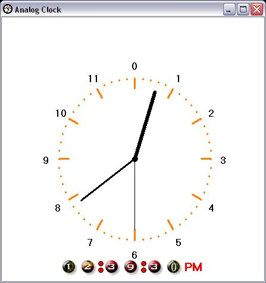



## Analog Clock

### Description

Graphicly display the current time on Analog format with transparent background and always on top window.
 
### More Info
 

             |
---                |---
**Submitted On**   |2005-12-26 15:24:48
**By**             |[Yasser Ahmed](https://github.com/Planet-Source-Code/PSCIndex/blob/master/ByAuthor/yasser-ahmed.md)
**Level**          |Intermediate
**User Rating**    |5.0 (10 globes from 2 users)
**Compatibility**  |VB 6\.0
**Category**       |[Graphics](https://github.com/Planet-Source-Code/PSCIndex/blob/master/ByCategory/graphics__1-46.md)
**World**          |[Visual Basic](https://github.com/Planet-Source-Code/PSCIndex/blob/master/ByWorld/visual-basic.md)
**Archive File**   |[Analog\_Clo2062644272007\.zip](https://github.com/Planet-Source-Code/yasser-ahmed-analog-clock__1-68466/archive/master.zip)

